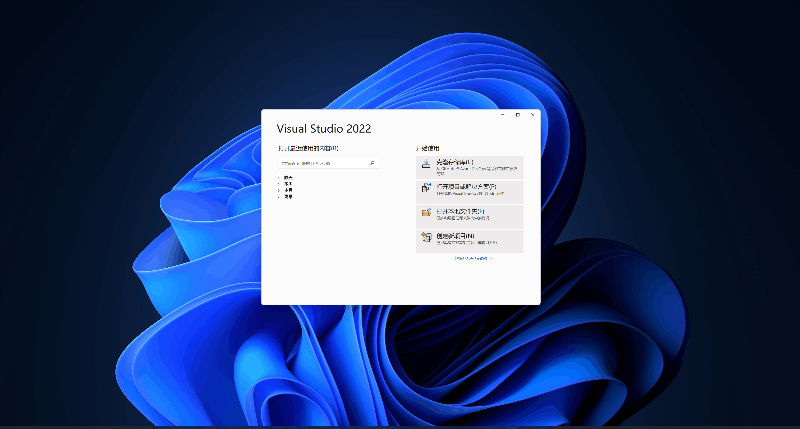

> ####  **背景:**
> * 项目中使用的开源组件，神马的只能使用`MinGW`或`Cygwin`在`Windows`上编译，怎么调试让头不那么疼？
> * 项目运行多个进程组件，出现问题该怎么调试？
> * 项目中进程`Main`启动进程`A`翻车，但是使用`CMD`启动进程`A`就特么一起正常，这又该怎么调试？
>
> 接下来就是见证*宇宙第一IDE - **Visual Studio*** 奇迹的时候，向大家介绍一些不常见的进程调试技巧

___

# 环境准备

```
工欲善其事必先利其器
                    - xxx
```

> ## Visual Studio 安装

> 先进的工具总能起到事半功倍的效果，所以我考虑使用 Visual Studio 2022 最新版本进行调试技巧演示。大家在保证不影响调试的情况下
> 下载其他版本的 Visual Studio。本文不再对 Visual Studio 的安装和使用做赘述，仅以链接的方式提供。

- [Visual Studio 下载]()
  
- [Visual Studio 安装]()
 
- [Visual Studio 使用]()


> ## MinGW编译项目

本文选择 [Nginx](https://www.nginx.com/) 作为`MinGW`的演示项目。本文不再对 [如何使用*MinGW*编译Nginx](https://note.youdao.com/s/ZHyptKSj) 做赘述。


> ## 多进程项目

本文选择两个进程项目进行调试验收，超过两个进行项目的调试技巧类似。首先我们已经有了 ***nginx*** 这个项目，还需要提供手动编写一个演示项目，其既
可以支持单独启动，又可以支持启动子进程。本文不再对 [演示进程项目]() 实现做赘述。

___

# 使用 *Visual Studio* 调试任一可执行程序
> ## 打开调试的可执行程序



> ## 设置调试符文件


> ## 调试可执行程序


___


# 使用 *Visual Studio* 调试多进程

> ## 设置多进程调试配置


> ## 多进程调试


___


# 使用 *Visual Studio* 调试父子进程

> ## **Microsoft Child Process Debugging Power Tool** 插件安装


> ## 调试项目结构


> ## 设置子进程调试配置


> ## 父子进程调试


# 参考文献
- [How to debug and profile any EXE with Visual Studio](https://devblogs.microsoft.com/visualstudio/how-to-debug-and-profile-any-exe-with-visual-studio/)
- [Introducing the Child Process Debugging Power Tool](https://devblogs.microsoft.com/devops/introducing-the-child-process-debugging-power-tool/)

