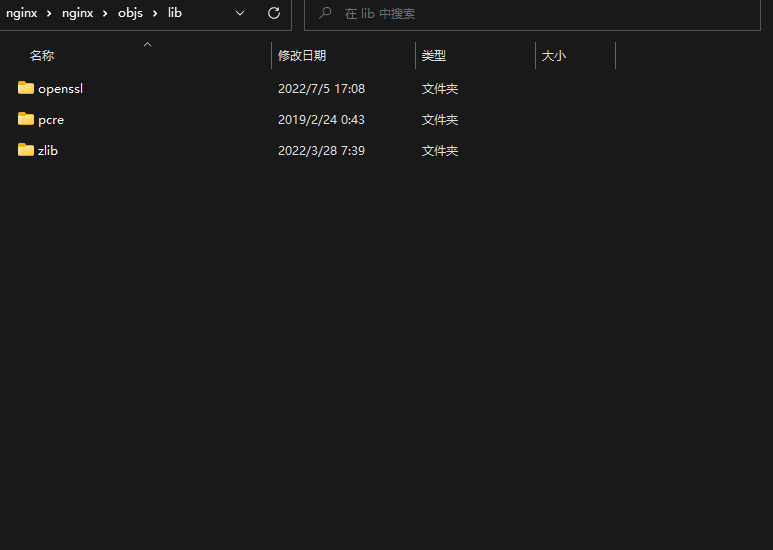

# MinGW 安装

使用MinGW GUI安装MinGW包


# 编译源码包清单

- [nginx](http://hg.nginx.org/nginx/file/tip)
- [pcre](https://ftp.exim.org/pub/pcre/)
- [zlib](http://zlib.net/)
- [openssl](https://www.openssl.org/source/)

# 构建步骤

1. 打开 **x86 Native Tools Command Prompt for VS {version}** 命令窗口
2. 进入有`msys.bat`的MinGW指定路径下 **MinGW\msys\1.0**
3. 执行`msys.bat`脚本后，会在 **MinGW\msys\1.0** 生成当前用户的文件目录且打开`MINGW32`的终端

1. 解压 `nginx` 包并在 `nginx` 目录下创建 `objs\lib` 目录层次

5. 将 `openssl` `pcre` `zlib` 源码包解压放到 `objs/lib` 目录下

6. `MINGW32`终端进入 `nginx` 源码执行下列脚本
   ```
   auto/configure \
    --with-cc=cl \
    --with-debug \
    --prefix= \
    --conf-path=conf/nginx.conf \
    --pid-path=logs/nginx.pid \
    --http-log-path=logs/access.log \
    --error-log-path=logs/error.log \
    --sbin-path=nginx.exe \
    --http-client-body-temp-path=temp/client_body_temp \
    --http-proxy-temp-path=temp/proxy_temp \
    --http-fastcgi-temp-path=temp/fastcgi_temp \
    --http-scgi-temp-path=temp/scgi_temp \
    --http-uwsgi-temp-path=temp/uwsgi_temp \
    --with-cc-opt=-DFD_SETSIZE=1024 \
    --with-pcre=objs/lib/pcre \
    --with-zlib=objs/lib/zlib \
    --with-openssl=objs/lib/openssl \
    --with-openssl-opt=no-asm \
    --with-http_ssl_module

   ```
7. 等待生成 `makefile` 文件

8. 执行 [nmake](https://docs.microsoft.com/en-us/cpp/build/reference/nmake-reference?view=msvc-170) 编译
   - 提示 `perl` 版本过低
   
   - 提示 `link.exe` 编译错误
   
9. 编译成功后，会生成程序文件 `nginx.exe` 和调试符合文件 `nginx.pdb`


# 解决 `nmake` 编译错误
## 解决 `perl` 版本过低问题

> 原因:
>> 安装的 **MinGW** 下的 `MSYS perl` 版本过低，`openssl` 编译版本高，依赖的 `perl` 版本要求高
1. 通过 ***MinGW Installation Manager*** 卸载安装的 `MSYS perl`
2. 下载 ***strawberry-perl*** 并安装


 ## 解决 `link.exe` 链接问题

> 原因:
>> **MinGW** 下的link.exe版本有问题，可以使用 **x86 Native Tools Command Prompt for VS {version}** 执行 `nmake -f objes/Makefile` 进行构建


# 参考文献
- [Building nginx on the Win32 platform with Visual C](http://nginx.org/en/docs/howto_build_on_win32.html)
- [MinGW的安装和使用](https://www.cnblogs.com/liangliangge/p/14737419.html)
- [MinGW安装及各个Package的作用](https://blog.csdn.net/ControlLearner/article/details/123669636)

